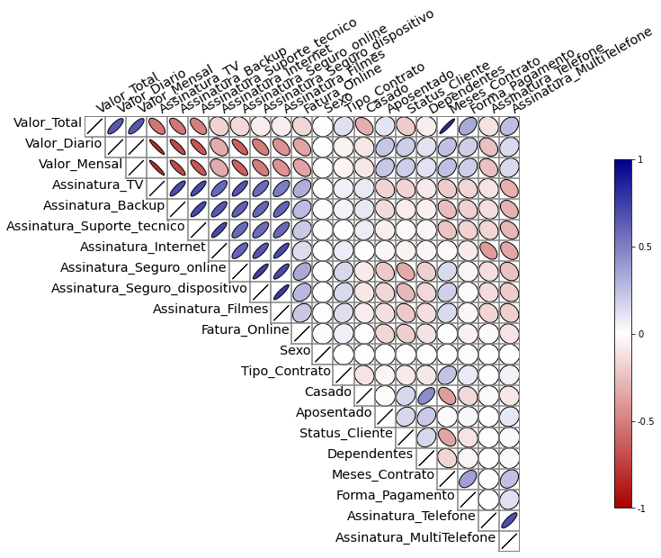

# **1º Challenge de Data Science Alura** 


Neste repositório estão os códigos, arquivos e resultados da análise de dados da empresa [Alura Voz](https://www.alura.com.br/challenges/data-science). O projeto foi desenvolvido durante os meses de Maio até Julho de 2022.


## Sumário 
**[1. Descrição do projeto](#1-descrição-do-projeto)**

**[2. Extração, limpeza e tratamento dos dados](#2-extração-limpeza-e-tratamento-dos-dados)**

- **[2.1 - Avaliação dos dados](#21---avaliação-dos-dados)**
- **[2.2 - Inspeção e limpeza dos dados](#22---inspeção-e-limpeza-dos-dados)**
- **[2.3 - Padronização dos dados](#23---padronização-dos-dados)**

**[3. Análise gráfica e relacional dos dados](#3-anc3a1lise-grc3a1fica-e-relacional-dos-dados-1)**

- **[3.1 - Análise correlacional](#31---análise-correlacional)**
- **[3.2 - Análise dgráfica da evasão de clientes](#32---análise-gráfica-de-evasão-de-clientes)**
- **[3.3 - Análise da qualidade dos serviços prestados](#33---análise-da-qualidade-dos-serviços-prestados)**
- **[3.4 - Forma de pagamento](#34---forma-de-pagamento)**
- **[3.5 - Tipo de contrato](#35---tipo-de-contrato)**
- **[3.6 - Análise do perfil dos clientes](#36---análise-do-perfil-dos-clientes)**

**[4. Construção de modelos de Machine Learning para classificação de clientes](#4-construção-de-modelos-de-machine-learning-para-classificação-de-clientes)**

- **[4.1 - Ajuste no dataset](#41---ajuste-no-dataset)**
- **[4.2 - Eliminação das variáveis não-úteis](#42---eliminação-das-variáveis-não-úteis)**
- **[4.3 - Identificação e eliminação das variáveis altamente correlacionadas](#43---identificação-e-eliminação-das-variáveis-altamente-correlacionadas)**
- **[4.4 - Análise da proporção de clientes ativos e inativos](#44---análise-da-proporção-de-clientes-ativos-e-inativos)**
- **[4.5 - Avaliação dos modelos de classificação](#45---avaliação-dos-modelos-de-classificação)**
- **[4.6 - Otimizando o modelo de classificação](#46---otimizando-o-modelo-de-classificação)**


---

# **1. Descrição do projeto** 

Neste projeto, é desenvolvido um conjunto de análises e modelos de machine learning supervisionados, para auxiliar na fidelização dos seus clientes de maneira mais assertiva. As atividades a serem realizadas são:
- Extração, limpeza e tratamento de dados.
- Análise exploratória e quantitativa dos dados.
- Interpretação dos dados e levantamento de hipóteses com bases nas análises.
- Criação de modelos de machine learning supervisionado para predizer a tendência de um novo cliente pedir cancelamento do plano.


# **2. Extração, limpeza e tratamento dos dados**

## **2.1 - Avaliação dos dados**
Esta é a primeira etapa a ser realizada do projeto. A base de dados é obtida por meio do seguinte [link](https://github.com/sthemonica/alura-voz/blob/main/Dados/Telco-Customer-Churn.json). Para melhor descrever a base de dados, a tabela a seguir exibe o dicionário dos dados fornecidos.

Nome da coluna | Dicionário da empresa
-------|------------------
`customerID`| Código único para o cliente da empresa
`Churn`| se o cliente deixou ou não a empresa
`gender`| gênero (masculino e feminino)
`SeniorCitizen`| informação sobre um cliente ter ou não idade igual ou maior que 65 anos
`Partner`| se o cliente possui ou não um parceiro ou parceira
`Dependents`| se o cliente possui ou não dependentes
`tenure`| meses de contrato do cliente
`PhoneService`| assinatura de serviço telefônico
`MultipleLines`| assinatura de mais de uma linha de telefone
`InternetService`| assinatura de um provedor internet
`OnlineSecurity`| assinatura adicional de segurança online
`OnlineBackup`| assinatura adicional de backup online
`DeviceProtection`| assinatura adicional de proteção no dispositivo
`TechSupport`| assinatura adicional de suporte técnico, menos tempo de espera
`StreamingTV`| assinatura de TV a cabo
`StreamingMovies`| assinatura de streaming de filmes
`Contract`| tipo de contrato
`PaperlessBilling`| se o cliente prefere receber online a fatura
`PaymentMethod`| forma de pagamento
`Charges.Monthly`| total de todos os serviços do cliente por mês
`Charges.Total`| total gasto pelo cliente

## **2.2 - Inspeção e limpeza dos dados**

Sabendo das variáveis presente nos dados, a próxima etapa é realizar a inspeção de seus valores. Usando a função *df.info()*, têm-se as seguintes ifnormações do dataframe

```python
<class 'pandas.core.frame.DataFrame'>
RangeIndex: 7267 entries, 0 to 7266
Data columns (total 21 columns):
Column           Non-Null Count  Dtype  
---  ------            --------------  -----  
 0   customerID        7267 non-null   object 
 1   Churn             7267 non-null   object 
 2   gender            7267 non-null   object 
 3   SeniorCitizen     7267 non-null   int64  
 4   Partner           7267 non-null   object 
 5   Dependents        7267 non-null   object 
 6   tenure            7267 non-null   int64  
 7   PhoneService      7267 non-null   object 
 8   MultipleLines     7267 non-null   object 
 9   InternetService   7267 non-null   object 
 10  OnlineSecurity    7267 non-null   object 
 11  OnlineBackup      7267 non-null   object 
 12  DeviceProtection  7267 non-null   object 
 13  TechSupport       7267 non-null   object 
 14  StreamingTV       7267 non-null   object 
 15  StreamingMovies   7267 non-null   object 
 16  Contract          7267 non-null   object 
 17  PaperlessBilling  7267 non-null   object 
 18  PaymentMethod     7267 non-null   object 
 19  Monthly           7267 non-null   float64
 20  Total             7267 non-null   object 
dtypes: float64(1), int64(2), object(18)
memory usage: 1.2+ MB
```

Apesar de não apresentar nenhum valor não nulo, algumas linhas podem estar sendo preenchidas com caracteres do tipo em branco. Assim, por garantia, é realizada uma última inspeção rodando o seguinte código:

```python
# Verificação de dados em branco
for column in df.columns:
  print('coluna {0}: {1} vazios. '.format( column, df.loc[ (df[column] == '') | (df[column].isnull()) | (df[column] == ' ') ][column].count()))
```
Obtendo assim a seguinte saída:

```python
coluna customerID: 0 vazios. 
coluna Churn: 224 vazios. 
coluna gender: 0 vazios. 
coluna SeniorCitizen: 0 vazios. 
coluna Partner: 0 vazios. 
coluna Dependents: 0 vazios. 
coluna tenure: 0 vazios. 
coluna PhoneService: 0 vazios. 
coluna MultipleLines: 0 vazios. 
coluna InternetService: 0 vazios. 
coluna OnlineSecurity: 0 vazios. 
coluna OnlineBackup: 0 vazios. 
coluna DeviceProtection: 0 vazios. 
coluna TechSupport: 0 vazios. 
coluna StreamingTV: 0 vazios. 
coluna StreamingMovies: 0 vazios. 
coluna Contract: 0 vazios. 
coluna PaperlessBilling: 0 vazios. 
coluna PaymentMethod: 0 vazios. 
coluna Monthly: 0 vazios. 
coluna Total: 11 vazios.
```
Com isso, sabe-se agora que a coluna *Churn* e *Total* possuem valores em branco/nulos. Como a quantidade é relativamente pequena (224 e 11) em relação ao total de registros (7267), então opta-se pelo descarte de tais linhas em branco.

Em adição, a coluna *customerID* também é descartada pois não haverá necessidade de identificar um determinado cliente nas análises seguintes.

## **2.3 - Padronização dos dados**

Este última etapa consiste em padronizar os dados. A primeira tarefa é de traduzir as colunas, de modo a facilitar a leitura e interpretação dos dados para o leitor que não esteja familiarizado com a língua inglesa. Após a tradução das colunas, são feitas duas cópias. A primeira cópida do dataframe contém os valores escritos em forma de texto (Yes/No) para facilitar na análise gráfica e relacional dos dados. A segunda cópia contém os dados em forma numérica (1/0) para facilitar na análise e treinamento dos algoritmos de aprendizado de máquina.

Mais informações e detalhes dos procedimentos realizados pode ser obtidos no [Notebook 1](https://github.com/goto-95/Challenge_DataScience_AluraVoz/blob/main/Challenge_DS_Alura_Semana01.ipynb) criado para esta primeira etapa

# **3. Análise gráfica e relacional dos dados**

Realizado o tratamento dos dados e a exportação em um arquivo *csv* mais simples, a próxima etapa é avaliar a relação que as variáveis têm entre si e, principalmente, com a taxa de cancelamento (descrito pela coluna `Churn` ou `Status_Cliente` na sua versão traduzida). Mais detalhes e informações podem ser obtidos no [Notebook 2](https://github.com/goto-95/Challenge_DataScience_AluraVoz/blob/main/Challenge_DS_Alura_Semana02.ipynb).

## **3.1 - Análise correlacional**

O primeiro passo é avaliar qual é o grau de correlação que as variáveis têm entre si. Para isto, é feita o carregamento do dataframe com os valores numérico [dados_tratados_obj.csv](https://github.com/goto-95/Challenge_DataScience_AluraVoz/blob/main/dados_tratados_num.csv). A matriz de correlação obtida é exibida abaixo. As relações entre as variáveis são apresentadas na forma gráfica utilizando círculos e elispses. Quanto maior a correlação entre duas variáveis, negativa ou positiva, maior será a distorção da elipse (tendendo a uma reta para o caso de `df.corr()= abs(1)`). Por outro lado, quanto menor for a correlção, mais próoximo de um círculo será o gráfico. As variáveis que contém uma correlação positiva entre si, apresentam uma elipse azul. Enquanto que as variáveis com correlação negativa apresentam uma elipse vermelha.

Com base no gráfico apresentado na Fig. 3.1, é possível observar que:

- Os clientes que possuem ***assinatura de TV*** também tendem a assinar os serviços de ***backup***, ***suporte técnico***, ***internet***, ***seguro online***, ***seguro do dispositivo móvel*** e o de ***filmes.***
- Em particular, os clientes que assinam os serviços de ***seguro,*** tanto o online quanto o do dispositivo móvel, tendem a preferir pela a optar pela cobrança online.
- Os clientes que assinam os serviços de telefone, tanto o da linha normal quanto o multi-linha, não apresentam interesse em adquirir os demais serviços
- O perfil dos clientes inativos indicam uma significativa correlação negativa com o valor anual do plano. Enquanto que apresentam uma correlação positiva com o valor mensal. Este comportamento precisa ser avaliado com mais detalhes.
- A coluna de clientes inativos apresenta uma correlação negativa com a coluna de ***Meses_Contrato*** que indica o tempo do contrato em meses. Enquanto apresenta uma correlação positiva com a coluna ***dependentes***.
<figure>
    
    <figcaption align = 'center'>
        <b> Figura 3.1: Matriz de correlação das variáveis da base de dados. </b>
    </figcaption>
</figure>


## **3.2 - Análise gráfica de evasão de clientes**

A próxima etapa é a avaliação do perfil dos clientes para entender o percentual de evasão, a relação do cancelemento com o perfil do cliente e coms os serviços prestados pela empresa.

### **Taxa total de evasão**
Primeiramente é avaliado a taxa total de evasão dos clientes. Como observado no gráfico da Fig. 3.2, é possível observar que o percentual de cancelamento é de em torno de 26.6%, o que é considerado relativamente alto.

<figure>
    
    <figcaption align = 'center'>
        <b> Figura 3.2: Percentual de evasão total dos clientes. </b>
    </figcaption>
</figure>

### **Perfil de gastos dos clientes**
A primeira hipótese está no fator financeiro. Avalia-se se o custo dos planos fornecidos possam influenciar na tendência de cancelamento. O primeiro gráfico, Fig. 3.3 avalia os valores dos planos mensais. Como é possível observar que:

- Os planos entre $60,00 e $100,00 apresentam maiores índices de cancelamento, maiores até que a média geral.
- Os planos abaixos de $20,00 apresentam a menor taxa de evasão, cerca de 10%. 

<figure>
    
    <figcaption align = 'center'>
        <b> Figura 3.3: Histograma dos valores dos planos mensais agrupados por status dos clientes. </b>
    </figcaption>
</figure>

A média dos planos mensais é apresentada na Fig. 3.4 confirma a hipótetse inicial que o fator financeiro têm forte influência no processo de cancelamento. Em síntese, observa-se que os valores dos planos mensais dos clientes que pediram cancelamento é maior que os clientes que não pediram cancelamento. Sugere-se que os clientes inativos tenham migrado para planos mais baratos da concorrência.

<figure>
    
    <figcaption align = 'center'>
        <b> Figura 3.4: Gráfico de barras dos valores médios dos planos mensais agrupados por status dos clientes. </b>
    </figcaption>
</figure>

Agora para os valores totais dos planos, Fig. 3.5, têm-se que os planos mais baratos apresentam a taxa de cancelamento de 37%. Isto pode indicar que, para os planos anuais, os clientes que aderem a menos serviços tem maior tendência de pedir cancelamento.  

<figure>
    
    <figcaption align = 'center'>
        <b> Figura 3.5: Histograma dos valores dos planos totais agrupados por status dos clientes. </b>
    </figcaption>
</figure>

Para confirmar tal avaliação, a Fig. 3.6 exibe o gráfico de barra dos valores médios dos planos anuais separados por status dos clientes. Nota-se que, de fato, os clientes com planos anuais mais baratos tem a maior chance de pedir o cancelamento.  

<figure>
    
    <figcaption align = 'center'>
        <b> Figura 3.6: Gráfico de barras dos valores médios dos planos anuais agrupados por status dos clientes. </b>
    </figcaption>
</figure>

### **Tempo de permacência dos clientes**

Sabendo das tendências dos clientes em relação a cada tipo de plano, agora deseja-se avaliar o tempo de permanência dos clientes com a empresa. No histograma de tempo total, Fig. 3.7, a maior parte dos clientes que pediram cancelamento ficaram menos de2 anos com a empresesa. Em especial, cerca de 50% do clientes pediram cancelamento antes do primeiro ano. 

<figure>
    
    <figcaption align = 'center'>
        <b> Figura 3.7: Histograma do tempo de contrato (em meses) dos planos agrupados por status dos clientes. </b>
    </figcaption>
</figure>

Olhando com mais detalhes no primeiro ano de contrato, Fig. 3.8, observa-se que cerca de 62% dos clientes pedem cancelamento no primeiro mês de serviço. Isto pode indicar uma falha na instalação, cobrança ou atendimento que comprometam a satisfação do cliente ao aderir ao plano. A medida que o tempo de contrato vai aumentando, o percentual de clientes que vão pedindo o cancelamento vai diminuindo e se aproximando da média, que é de 26%.

<figure>
    
    <figcaption align = 'center'>
        <b> Figura 3.8: Histograma dos primeiros 12 meses dos planos agrupados por status dos clientes. </b>
    </figcaption>
</figure>

## **3.3 - Análise da qualidade dos serviços prestados**
Esta etapa tem por objetivo entender se a qualidade dos serviços fornecidos pela empresa têm influência na taxa de cancelamento. Como a empresa dispõem de disversos serviços, serão mostrados os resultados mais importantes.

### **Serviço de TV**

Para o serviço de assinatura de TV, os dados são descrito como clientes que possuem ou não o serviço e os clientes que não possuem o serviço de internet. Pela Fig. 3.9, observa-se que a taxa de cancelamento entre os cliente que possuem ou não o serviço de TV apresentam valores próximos entre si, em torno de 30 à 33%. Enquanto os clientes que não tem o serviço de internet apresentam uma taxa de cancelamento muito menor, em torno de 7.4%. Isto indica que o serviço de internet fornecido pode não ser satisfatório. A próxima análise irá verificar esta hipótese.

<figure>
    
    <figcaption align = 'center'>
        <b> Figura 3.9: Gráfico de barras categórico para o fornecimento do serviço de assinatura de TV.</b>
    </figcaption>
</figure>

### **Serviço de internet**

Para o serviço de internet, Fig. 3.10,  observa-se que a taxa de cancelamento para o serviço de internet via fibra óptica é consideralvemente alta (cerca de 42%) comparada ao fornecimento via DSL. Isto indica que a qualidade da internet via fibra óptica não está atendendo aos clientes.

<figure>
    
    <figcaption align = 'center'>
        <b> Figura 3.10: Gráfico de barras categórico para o fornecimento do serviço de assinatura de internet.</b>
    </figcaption>
</figure>

### **Serviço de suporte técnico**

Para o serviço de suporte técnico, Fig. 3.11, observa-se que a taxa de cancelamento é significativamente alto (cerca de 42%) para os planos que não possuem este serviço. Enquanto que a taxa de cancelamento para os planos com o suporte é menor, cerca de 16%.

<figure>
    
    <figcaption align = 'center'>
        <b> Figura 3.11: Gráfico de barras categórico para o fornecimento do serviço de assinatura do serviço de suporte técnico.</b>
    </figcaption>
</figure>

## **3.4 - Forma de pagamento**
Também pe verificado se há alguma relação entre a forma de pagamento e a taxa de cancelamento. Com base na Fig. 3.12, as formas de pagamento via boleto, credit card e transferência bancária apresentam a taxa de cancelamento menor que a média geral. Enquanto que a forma de boleto eletrônico apresenta uma taxa significativamente maior, em torno de 46%. Isto pode ser um indicador a possíveis problemas de geração de boletos online.

<figure>
    
    <figcaption align = 'center'>
        <b> Figura 3.12: Gráfico de barras categórico para o a forma de pagamento escolhido pelo cliente.</b>
    </figcaption>
</figure>

## **3.5 - Tipo de contrato**
Outro aspecto observado é o tipo de contrato escolhido pelo cliente. Pelo Fig. 3.13, foi observado que os clientes que optam pelo plano mensal tem mais chances de pedir o cancelamento. A taxa de evasão para este tipo de plano é de em torno de 43%.

<figure>
    
    <figcaption align = 'center'>
        <b> Figura 3.13: Gráfico de barras para o tipo de contrato escolhido pelo cliente.</b>
    </figcaption>
</figure>

## **3.6 - Análise do perfil dos clientes**

### **Influência da idade do cliente**

A Fig. 3.14 mostra que os clientes aposentados possuem uma taxa de evasão de aproximadamente 42%. 
<figure>
    
    <figcaption align = 'center'>
        <b> Figura 3.14: Gráfico de barras para a relação da idade com a taxa de cancelamento.</b>
    </figcaption>
</figure>

### **Influência do estado civil do cliente**

De forma complementar, avalia-se a influência do estado civil dos clientes com a taxa de cancelamento. Pela Fig. 3.15, os clientes casados possuem uma taxa de evasão menor que os clientes não casados. Isto pode indicar relação direta com a presença de dependentes no local, como indicado no mapa de correlação ([Seção 3.1](#31---análise-correlacional)).

<figure>
    
    <figcaption align = 'center'>
        <b> Figura 3.15: Gráfico de barras para a relação da idade com a taxa de cancelamento.</b>
    </figcaption>
</figure>


# **4. Construção de modelos de Machine Learning para classificação de clientes**
Esta última etapa consiste em avaliar diversos modelos de classificação e otimizar o melhor classificador para o problema avaliado. Mais detalhes e procedimentos executados podem ser encontrados no [Notebook 3](https://github.com/goto-95/Challenge_DataScience_AluraVoz/blob/main/Challenge_DS_Alura_Semana03.ipynb).

##  **4.1 - Ajuste no dataset**
Para evitar quaisquer erro de interpretação dos dados, a variável *Status_Cliente* é invertida de forma que:

- 1 = Cliente ativo
- 0 = Cliente inativo

## **4.2 - Eliminação das variáveis não-úteis**
Pelo o que foi observado do arquivo de análise gráfica (*Challenge_DS_Alura_Semana02.ipynb*), é possível ter uma noção de quais variáveis não apresentam influência significativa. Assim, a lista de variáveis que não possuem influência na variável ***Status_Cliente*** são:

1. ***Sexo***: O gênero não apresenta influência alguma com a variável de estudo.
2. ***Assinatura_Telefone***: O serviço de assinatura de telefone não apresenta influência na taxa de cancelamento dos clientes. 
3. ***Assinatura_MultiTelefone***: De forma semelhante, o serviço de assinatura multi linha também não paresenta influência na taxa de cancelamento dos clientes.

## **4.3 - Identificação e eliminação das variáveis altamente correlacionadas**

Variáveis altamente correlacionadas podem influenciar negativamente na eficiência no modelo por torna-lo enviesado. Para isto, a tabela de correlação é útil para verificar quais variáveis tem alta correlação (negativa ou positiva) entre si. Assim, observa-se que:

1. ***Valor_Total***: Esta variável possui alta correlação com a variável ***Valor_Mensal***. 
2. ***Valor_Diario***: Esta variável também possui alta correlação com a variável ***Valor_Mensal***. 
3. ***Assinatura_Backup***: Esta variável possui alta correlação com a variável ***Assinatura_Suporte_Tecnico***.
4. ***Assinatura_Seguro_Dispositivo***: Esta variável possui alta correlação com a variável ***Assinatura_Seguro_Online***.

Assim, é possível reduzir estas variáveis em 3 sem perda significativa de informação para o modelo. A saber: ***Valor_Mensal***, ***Assinatura_Suporte*** e ***Assinatura_Segurança***.

## **4.4 - Análise da proporção de clientes ativos e inativos**

Como a variável ***Statuts_Cliente*** tem a proporção de 1:4 das respostas (inativo para ativo), é aconselhável realizar uma verificação das técnicas de balanceamento. Por mais que a proporção da classe de registro minoritária (Clientes inativos) seja relativamente grande, em torno de 26.5%, o modelo ainda pode sofrer certo grau de enviesamento. Para isto, algumas técnicas de balanceamento serão analisadas. Tais técnicas consistem em reduzir a disparidade entre a classe marjoritária (neste caso, cliente ativo) e a minoritária (cliente inativo). Além disto, também é possível realizar tratamento de registros que possam ser considerados ambíguos pelos algoritmos de classificação. Para este projeto, são avaliados as seguintes técnicas:

- **Randon Under Sampler**: A técnica de desbalaceamento RandomSampling é a mais simples e consiste na escolha aleatória de registros da classe marjoritária para o descarte, de forma a aumentar a diminuir a disparidade entre as classes minoritárias e marjoritárias.

- **NearMiss**: Near Miss é um conjunto de técnicas UnderSampling the seleciona os exemplos baseado na distância dos dados marjoritários.

- **Condesed Nearest Neighbour**: O método Condensed Nearest Neighbour (CNN) é uma técnica de de UnderSampling que procura o conjunto de amostras de uma classe que resulta em perda mínima da performance do modelo, referenciado como conjunto minimamente consistente. 

- **One-Sided Selection**: O método One-Sided Selection (OSS) é uma combinação dos métodos Tomek Link e Condensed Nearest Neighbor (CNN). O método OSS então  utiliza o Tomek Link para remover os exemplos ambíguos e depois utiliza o método CNN para remover os exemplos redundantes que estão distantes dos contornos das classes.

- **Neighborhood Cleaning Rule**: O método Neighborhood Cleaning Rule (NCR) consiste na combinação do método ENS para o tratamento de exemplos ambíguos e o método CNN para o tratamento dos exemplos redundantes. Entretanto, diferentemente do método OSS, o método CNR esta mais focado na limpeza dos exemplos que necessariamente na remoção de exemplos redundantes. Portanto, o método NCR está mais focado no tratamento dos exemplos ambíguos.

Dentre as técnicas citadas, a NCR é a que apresentou melhor performance nas avaliações. Isto porque os demais métodos são mais eficientes em proporções de classes minoritárias menores, onde a exclusão de registros da classe marjooritária não afeta significativamente o modelo. Enquanto o NCR apenas elimina os dados redudantes.

## **4.5 - Avaliação dos modelos de classificação**

Como etapa preliminar, uma função será construída compilando os principais algoritmos de Machine Learning para classificação. Para isto, serão utilizados os seguintes algoritmos de classficação supervisionados:

- Logistic Regression:

    O Logistic Regression utiliza a função de Sigmoid para gerar a probabilidade de uma determinada classificação. Este algoritmo é largamente utilizado quando o dataset possui uma classificação binária (0/1, verdadeiro/falso, etc). 

    Para o caso de um dataset multiclasse, o algoritmo utiliza a abordagem um versus restante. É possível configurar isto definindo o parâmetro multi_class como ovr.  Também é possível ajustar o solver (solver), penalidade (penalty) e a distribuição da classe (class_weight). 

- Decision Tree Classifier:

    O algoritmo Desicion Tree Classifier é um algoritmo de classificação onde as características mais importantes da dos dados vão sendo subdivididos em avaliações de verdadeiro ou falso. A partição dos dados permite montar um padrão de classificação por meio das ramificação da árvore, onde um determinado registro pode ser classificado ao ser comparado com a árvore de decisão.

- Random Forest:

    O algoritmo Random Forest é uma combinação de vários Decisions Tree. Este algoritmo utiliza a técnica de sub-amostragem e aplica a média das amostras para melhorar a previsão e contralar o problema de overfiting. 

- k-Neighbor Classifier:

    Este algoritmo utiliza a abordagem de distância entre os registro em um espeço vetorial correspondente. Registros que possuem uma distância média pequena tendem a ter a mesma classificação. Este tipo de algoritmo também é bastante utiliado como sistema de recomendação. 

- Gaussian Nayve-Bayes:

    O algoritmo Gaussian Navye-Bayes é baseado no Teorema de Bayes onde a probabilidade condicional é calculada com base em uma informação dada. A condição de Naive assume que as informações dos registros são independentes (outro motivo para a eliminação das variáveis altamente correlacionadas). A grande vantagem deste algoritmo é que, diferentemente dos demais algoritmos de aprendizado, este não necessita de um grande banco de dados para apresentar uma boa performance nas previsões.

- Support Vector Machine:

    O Support Vector Machine é um algoritmo onde utiliza de um hiper palno para separar os registros em duas classes: negativa e positiva. Este hiper plano é calculado com base na maximização da distância entre os pontos. Com o hiper plano definindo a borda entre as duas classes, o algoritmo realiza a previsão da classificação com base na posição de um determinado registro neste espaço vetorial.

    Este algortimo, assim como Decision Tree e o Random Forest, pode ser utilizado tanto para classificação quanto para regresão.

- Ada Boost:

    O algoritmo Ada Boost é nada mais que um compilado de vários algoritmos de previsão mais simples (e menos eficientes) organizados de forma iterativa de modo a fornecer, no conjunto, um algoritmo de previsão com alta eficiência. A ideia é avaliar uma combinação linear entre os resultados entre vários sub-modelos e otimizar os pesos de tais modelos de forma a fornecer a maior acurácia possível.

- Gradient Boosting Classifier:

    De forma semelhante ao Ada Boost, o Gradient Boosting Classifier configura-se como um compilado de árvores de decisão (Decission Trees). 

Utilizando a técnica NCR de balanceamento, os modelos foram avaliados utilizando Cross-Validation e extraindo a média da precisão, acurácia e recall. A tabela abaixo exibe os resultados obtidos para cada modelo.

Modelo | Acurácia (%) | Precisão (%) | Recall (%)
-------|----------|----------| -------- 
KNeighborsClassifier |	86.1 | 88.2	| 91.8
RandomForestClassifier | 86.1 | 87.7 | 92.4
GradientBoostingClassifier | 85.5 | 87.5 | 91.8
AdaBoostClassifier	| 84.6	| 87.8	| 89.8
LogisticRegression	| 84.1	| 86.5	| 90.7
SupportVectorMachine | 81.8	| 82.7	| 92.6
DecisionTreeClassifier | 80.9 | 86.4 | 85.3
GaussianNB | 80.3 | 90.3 | 79.6
---

## **4.6 - Otimizando o modelo de classificação**

A última etapa é a otimização hiperparamétrica. Para isto, foi utilizada a função *RandomizedSearchCV* onde a busca em alguns pontos do espaço de otimização é avaliado aleatoriamente. O melhor conjunto de parametros forneceu uma precisão média de 86.6%.  


